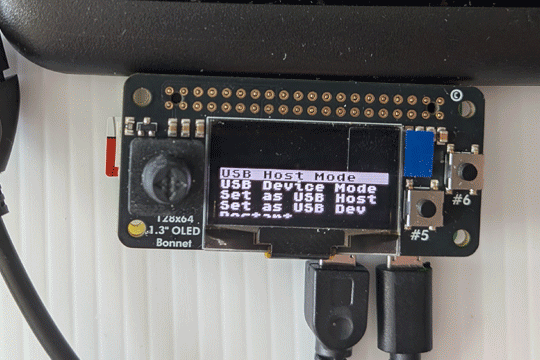
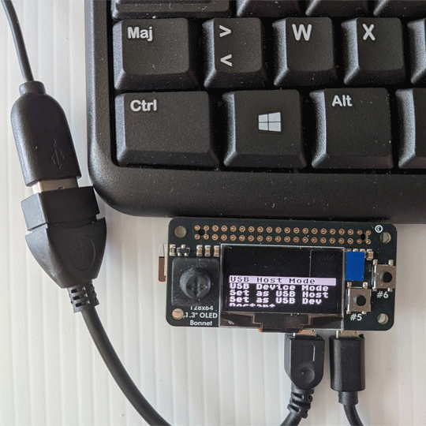
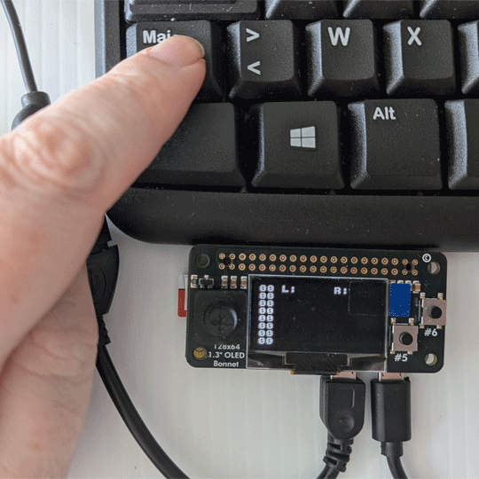
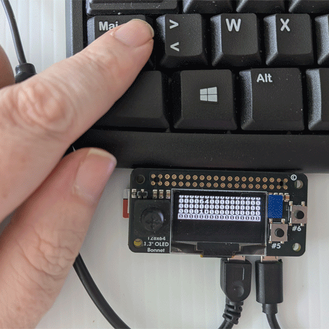
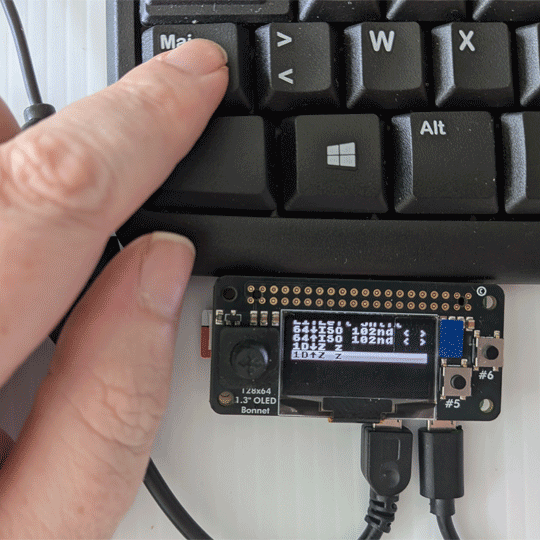
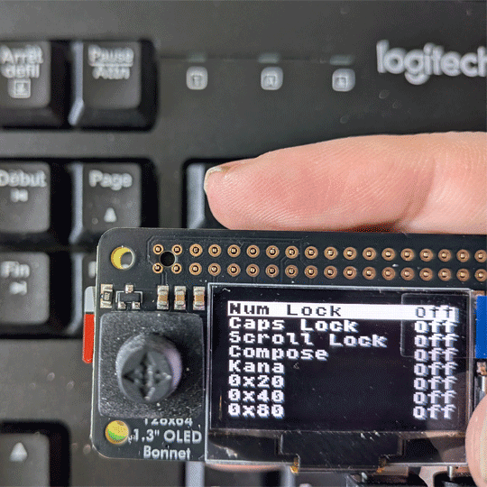
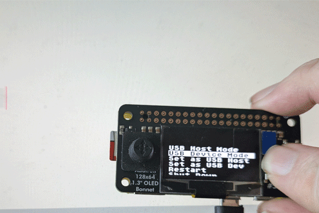
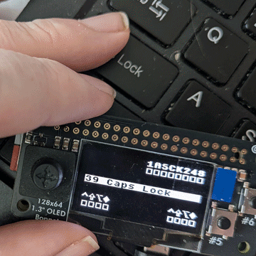

# KreativeKorp AnyKey
The KreativeKorp AnyKey is a widget for inspecting input reports generated by USB keyboards or sending arbitrary key events to a USB host.

This version uses a Raspberry Pi Zero and an [Adafruit 128x64 OLED Bonnet](https://www.adafruit.com/product/3531).

## Setup
* Install the OLED Bonnet on the Raspberry Pi Zero.
* Prepare an SD card with Raspberry Pi OS Lite 32-bit using [Raspberry Pi Imager](https://www.raspberrypi.com/software/).
* Go through all the setup rigmarole with `raspi-config`. Enable ssh, I2C, SPI.
* Create a user called `anykey`. The AnyKey software will run from this user's home directory.
* Install the [Adafruit CircuitPython libraries](https://learn.adafruit.com/circuitpython-on-raspberrypi-linux/installing-circuitpython-on-raspberry-pi).
* Merge the contents of the `userland` directory into the Pi's root filesystem.
* Enable the `startup-sh.service` to run at boot time.

## Main Menu
Now when the Pi starts up, it will bring up the AnyKey menu.

Press up and down on the joystick to select the menu item. Press the A/#5 button to activate it.

* **USB Host Mode**: Inspects input reports generated by USB keyboards. The keyboard must be connected to the Pi's data port with a USB OTG cable.
* **USB Device Mode**: Sends arbitrary key events to a USB host. The Pi's data port must be connected to the host machine.
* **Set as USB Host**: Configures the Pi to act as a USB host. Must be selected before using USB Host Mode. Changes take effect after restart.
* **Set as USB Dev**: Configures the Pi to act as a USB device. Must be selected before using USB Device Mode. Changes take effect after restart.
* **Restart**: Restarts the Pi.
* **Shut Down**: Powers off the Pi.

## USB Host Mode
Inspects input reports generated by USB keyboards. The keyboard must be connected to the Pi's data port with a USB OTG cable.

Press up and down on the joystick to select the keyboard to inspect. Press left or right to refresh the list of attached keyboards. Press the A/#5 button to start. Press the B/#6 button to return to the main menu.

Once inside USB Host Mode, press left or right to switch between screens. Press the B/#6 button to return to the keyboard list.

### Screen 1: Live Report
Presents a live view of the last report sent by the keyboard.

### Screen 2: Report Log
Presents a list of reports sent by the keyboard in chronological order.

Press up and down to scroll through the list of reports. Press the A/#5 button to view the selected report. Hold the A/#5 button and press the B/#6 button to clear the log.

### Screen 3: Event Log
Presents a list of key press and key release events in chronological order.

Press up and down to scroll through the list of events. Hold the A/#5 button and press the B/#6 button to clear the log.

### Screen 4: LEDs
Turns on and off the num lock, caps lock, and other LEDs on the keyboard.

Press up and down to scroll through the list of LEDs. Press the A/#5 button to toggle the selected LED.

## USB Device Mode
Sends arbitrary key events to a USB host. The Pi's data port must be connected to the host machine.

Press left and right to move between the key code in the center of the screen and the modifier keys along the bottom. Press up and down to select the desired key code or to toggle the selected modifier key. Press the A/#5 button to send the selected key code. Press the B/#6 button to return to the main menu.

The num lock, caps lock, and other keyboard LEDs are shown along the top on the screen. In order, they are: num lock, caps lock, scroll lock, compose, kana, and three undefined bits.
